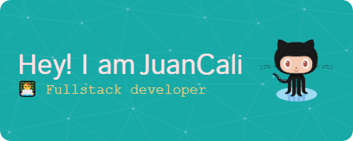

#  Bienvenid@ a mi perfil de GitHub JuanCali

Me apasiona la tecnología y deseo compartir mis conocimientos y proyectos en programación y tecnologías en GitHub 👾. Aquí encontrarás repositorios de proyectos de la UPC, donde estudio Ingeniería de Software, incluyendo aplicaciones web y open source.

### Skills

